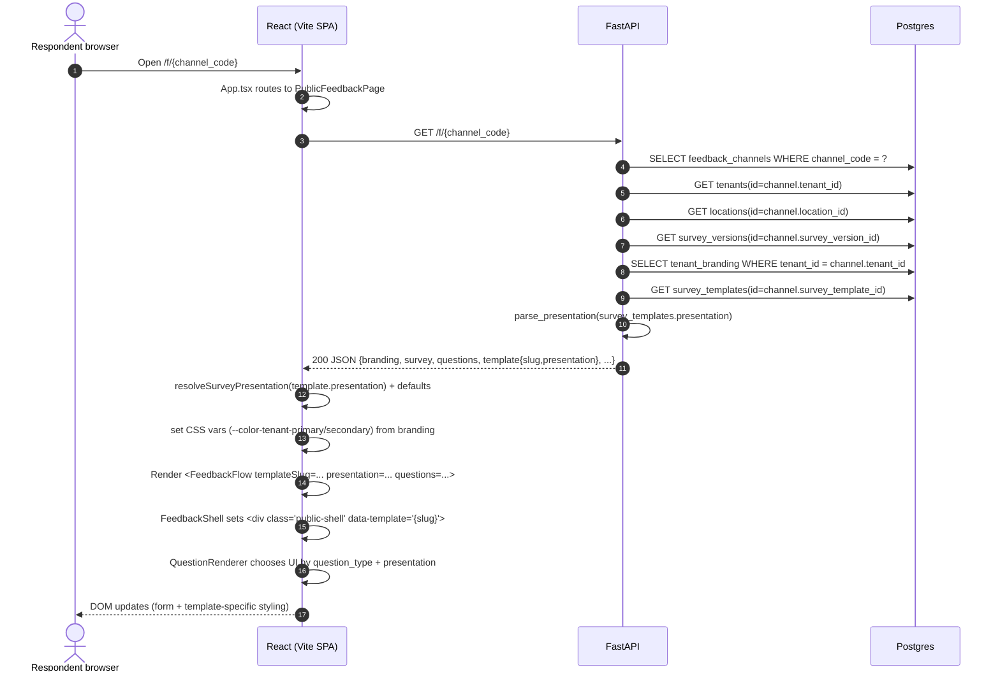

## Current state architecture (FastAPI + React/Vite)

Scope: **surveys + public rendering + templates + branding** as implemented today. This document is descriptive only.

---

## 1) Current data model

The public-feedback experience is driven by **published survey versions** attached to a **feedback channel**; channels also point at a **survey template**; branding is **tenant-scoped**.

### Tables involved (surveys/templates/branding)

#### `tenants`

| Column | Type | Null | Notes |
|---|---:|:---:|---|
| `id` | UUID (PK) | No | Primary key |
| `name` | varchar(255) | No | Display name |
| `slug` | varchar(80) | No | Unique (`uq_tenants_slug`) |
| `default_locale` | varchar(16) | No | Default `"en"` |
| `status` | enum `tenant_status` | No | `active` / `suspended` / `offboarded` |
| `suspended_at` | timestamptz | Yes | Suspension timestamp |
| `offboarded_at` | timestamptz | Yes | Offboarding timestamp |
| `created_at` / `updated_at` | timestamptz | No | Timestamp mixin |

**Relationships**
- `tenants (1) → (0..1) tenant_branding` via `tenant_branding.tenant_id` (`uq_tenant_branding_tenant_id`)
- `tenants (1) → (0..n) locations` via `locations.tenant_id`
- `tenants (1) → (0..n) surveys` via `surveys.tenant_id`
- `tenants (1) → (0..n) survey_versions` via `survey_versions.tenant_id`
- `tenants (1) → (0..n) questions` / `question_options` / `translations` via `tenant_id`
- `tenants (1) → (0..n) feedback_channels` via `feedback_channels.tenant_id`

#### `tenant_branding`

| Column | Type | Null | Notes |
|---|---:|:---:|---|
| `id` | UUID (PK) | No | Primary key |
| `tenant_id` | UUID (FK) | No | `tenants.id` (CASCADE), unique per tenant |
| `logo_url` | text | Yes | Used by public UI header/hero |
| `primary_color` | varchar(16) | Yes | Written into CSS var `--color-tenant-primary` |
| `secondary_color` | varchar(16) | Yes | Written into CSS var `--color-tenant-secondary` |
| `thank_you_text` | text | No | Returned on submit + default thank-you screen |
| `created_at` / `updated_at` | timestamptz | No | Timestamp mixin |

**Relationships**
- `tenant_branding (1) → (1) tenants` via `tenant_branding.tenant_id`

#### `locations`

| Column | Type | Null | Notes |
|---|---:|:---:|---|
| `id` | UUID (PK) | No | Primary key |
| `tenant_id` | UUID (FK) | No | `tenants.id` (CASCADE) |
| `name` | varchar(255) | No | Display name |
| `code` | varchar(80) | No | Unique per tenant (`uq_locations_tenant_id_code`) |
| `city` | varchar(120) | Yes | Used in admin filters; public returns `city`/`region` |
| `region` | varchar(120) | Yes | Public returns `region` |
| `address` | text | Yes | Not returned in public context |
| `is_active` | bool | No | Active flag |
| `created_at` / `updated_at` | timestamptz | No | Timestamp mixin |

**Relationships**
- `locations (n) → (1) tenants` via `locations.tenant_id`
- `feedback_channels (n) → (1) locations` via `feedback_channels.location_id`
- `responses (n) → (1) locations` via `responses.location_id` (created in migration `0004_feedback_submit`)

#### `surveys`

| Column | Type | Null | Notes |
|---|---:|:---:|---|
| `id` | UUID (PK) | No | Primary key |
| `tenant_id` | UUID (FK) | No | `tenants.id` (CASCADE) |
| `created_by_user_id` | UUID | Yes | Added by `0005_granular_rbac` (no FK in model) |
| `title` | varchar(255) | No | Public uses this as header title |
| `slug` | varchar(120) | No | Unique per tenant (`uq_surveys_tenant_id_slug`) |
| `description` | text | Yes | Public passes through; some templates use it as tagline/closing |
| `default_locale` | varchar(16) | No | Public uses this when submitting |
| `status` | enum `survey_status` | No | `draft` / `published` / `archived` |
| `created_at` / `updated_at` | timestamptz | No | Timestamp mixin |

**Relationships**
- `surveys (1) → (0..n) questions` via `questions.survey_id`
- `surveys (1) → (0..n) survey_versions` via `survey_versions.survey_id`

#### `survey_versions`

| Column | Type | Null | Notes |
|---|---:|:---:|---|
| `id` | UUID (PK) | No | Primary key |
| `tenant_id` | UUID (FK) | No | `tenants.id` (CASCADE) |
| `survey_id` | UUID (FK) | No | `surveys.id` (CASCADE) |
| `version_number` | int | No | Unique per survey (`uq_survey_versions_survey_version`) |
| `status` | enum `survey_version_status` | No | `published` / `archived` |
| `schema_snapshot` | jsonb | No | Frozen JSON used by public API (`build_schema_snapshot`) |
| `published_at` | timestamptz | No | Published timestamp |
| `published_by_user_id` | UUID | Yes | Publisher user id (no FK in model) |
| `created_at` / `updated_at` | timestamptz | No | Timestamp mixin |

**Relationships**
- `survey_versions (n) → (1) surveys` via `survey_versions.survey_id`
- `feedback_channels (n) → (1) survey_versions` via `feedback_channels.survey_version_id` (**RESTRICT** on delete)

#### `questions`

| Column | Type | Null | Notes |
|---|---:|:---:|---|
| `id` | UUID (PK) | No | Primary key |
| `tenant_id` | UUID (FK) | No | `tenants.id` (CASCADE) |
| `survey_id` | UUID (FK) | No | `surveys.id` (CASCADE) |
| `question_key` | varchar(120) | No | Unique per survey (`uq_questions_survey_question_key`); used as stable key in answers |
| `question_type` | enum `question_type` | No | See **Question type inventory** below |
| `prompt` | text | No | Public displays as question title |
| `help_text` | text | Yes | Public displays under title |
| `is_required` | bool | No | Client-side validation + backend validation |
| `is_pii` | bool | No | Used in submission pipeline (e.g. encryption/handling) |
| `sort_order` | int | No | Public sorts by this |
| `branching_metadata` | jsonb | No | Default `{}`; included in snapshot |
| `created_at` / `updated_at` | timestamptz | No | Timestamp mixin |

**Relationships**
- `questions (1) → (0..n) question_options` via `question_options.question_id`
- `questions (n) → (1) surveys` via `questions.survey_id`

#### `question_options`

| Column | Type | Null | Notes |
|---|---:|:---:|---|
| `id` | UUID (PK) | No | Primary key |
| `tenant_id` | UUID (FK) | No | `tenants.id` (CASCADE) |
| `question_id` | UUID (FK) | No | `questions.id` (CASCADE) |
| `value` | varchar(120) | No | Unique per question (`uq_question_options_question_value`); submitted as answer value |
| `label` | text | No | Display text in UI |
| `sort_order` | int | No | UI sorts by this |
| `created_at` / `updated_at` | timestamptz | No | Timestamp mixin |

#### `translations`

| Column | Type | Null | Notes |
|---|---:|:---:|---|
| `id` | UUID (PK) | No | Primary key |
| `tenant_id` | UUID (FK) | No | `tenants.id` (CASCADE) |
| `entity_type` | varchar(80) | No | Generic “survey/question/etc” |
| `entity_id` | UUID | No | Target entity UUID |
| `locale` | varchar(16) | No | Locale code |
| `field_name` | varchar(80) | No | Which field is translated |
| `translated_value` | text | No | Translated text |
| `created_at` / `updated_at` | timestamptz | No | Timestamp mixin |

#### `survey_templates` (global)

| Column | Type | Null | Notes |
|---|---:|:---:|---|
| `id` | UUID (PK) | No | Primary key |
| `slug` | varchar(64) | No | Unique (`uq_survey_templates_slug`); becomes frontend `data-template` attribute |
| `name` | varchar(255) | No | UI label |
| `description` | text | Yes | Human description |
| `deployment_notes` | text | Yes | Human notes (admin-facing) |
| `presentation` | jsonb | No | Validated by `SurveyPresentationConfig`; returned to public frontend |
| `sort_order` | int | No | Gallery ordering |
| `is_active` | bool | No | Gate in public API (`is_active` must be true) |
| `created_at` / `updated_at` | timestamptz | No | Timestamp mixin |

**Relationships**
- `feedback_channels (n) → (1) survey_templates` via `feedback_channels.survey_template_id` (**RESTRICT** on delete)

#### `feedback_channels`

| Column | Type | Null | Notes |
|---|---:|:---:|---|
| `id` | UUID (PK) | No | Primary key |
| `tenant_id` | UUID (FK) | No | `tenants.id` (CASCADE) |
| `location_id` | UUID (FK) | No | `locations.id` (CASCADE) |
| `survey_version_id` | UUID (FK) | No | `survey_versions.id` (RESTRICT) |
| `survey_template_id` | UUID (FK) | No | `survey_templates.id` (RESTRICT) |
| `name` | varchar(255) | No | Human name |
| `channel_code` | varchar(32) | No | Unique (`uq_feedback_channels_channel_code`); used in public URL |
| `channel_type` | enum `channel_type` | No | `qr` / `kiosk` |
| `status` | enum `channel_status` | No | `active` / `disabled` |
| `qr_url` | text | Yes | Stored QR destination |
| `metadata` | jsonb | No | Default `{}` |
| `created_at` / `updated_at` | timestamptz | No | Timestamp mixin |

---

## 2) Current rendering flow

Public URLs are handled client-side under `/f/:channelCode` and backed by FastAPI routes mounted at `/f/{channel_code}`.

---

## 3) Current template system (slug + presentation + CSS + branding)

### Where each part comes from

- **Template identity (`survey_templates.slug`)**
  - Stored in `survey_templates.slug` and selected per channel via `feedback_channels.survey_template_id`.
  - Returned by public API as `template.slug`.
  - Used in the DOM as `data-template="{slug}"` on the root shell:
    - `FeedbackShell` renders `
…
`.

- **Template “presentation” (`survey_templates.presentation`)**
  - Stored in `survey_templates.presentation` (JSONB).
  - Public API loads the `SurveyTemplate` row and runs `parse_presentation(survey_template.presentation)` which validates into `SurveyPresentationConfig`.
    - `SurveyPresentationConfig` also merges a **legacy** top-level `csat` block into `csat_5/csat_4/csat_2` if needed.
  - Frontend receives `template.presentation` and runs `normalizeSurveyPresentation` which fills defaults and also upgrades legacy `csat.presentation` to `csat_*` renderer blocks.
  - **What this controls in the UI**
    - `presentation.layout`: stepper vs single page.
    - `presentation.nps.presentation`: numeric vs segmented.
    - `presentation.csat_5/csat_4/csat_2.renderer`: which CSAT widgets to render.
    - `presentation.progress.style`: bar/dots/none.
    - `presentation.navigation.auto_advance`: stepper auto-advance behavior.
    - `presentation.touch.large_targets`: adds `public-shell--large-targets` class.

- **CSS styling (per-slug CSS files)**
  - All public theme CSS files are imported globally in `frontend/src/main.tsx`:
    - `public-feedback.css`
    - `public-feedback-kiosk.css`
    - `public-feedback-heritage.css`
    - `public-feedback-jewelry-card.css`
  - Template-specific styling is activated via attribute selectors:
    - `.public-shell[data-template="kiosk_touch"] { … }`
    - `.public-shell[data-template="heritage_immersive"] { … }`
    - `.public-shell[data-template="heritage_luxury"]` (jewelry card layout; `jewelry-card-*` shell classes)
  - The “default” templates (e.g. `default_stepper`, `single_page`) do **not** have dedicated selectors; they use the baseline rules from `public-feedback.css`.

- **Tenant branding (`tenant_branding`)**
  - Returned from the public API as:
    - `branding.logo_url`, `branding.primary_color`, `branding.secondary_color`, `branding.thank_you_text`.
  - Frontend applies **colors** by mutating root CSS variables on `document.documentElement`:
    - `--color-tenant-primary` from `branding.primary_color` (or removed if null)
    - `--color-tenant-secondary` from `branding.secondary_color` (or removed if null)
  - Frontend applies **logo** by rendering an `` when present; otherwise a fallback initial.
  - `branding.thank_you_text` is used:
    - in the submit response screen, and
    - returned by the submit endpoint for consistency.

### CSS variable names (current + legacy alias requirement)

- Today, public CSS uses `--color-tenant-primary` / `--color-tenant-secondary` (defined with defaults in `frontend/src/styles/tokens.css`, and overridden at runtime by `PublicFeedbackPage` when branding provides colors).
- For any future tokenization, keep `--color-tenant-primary` and `--color-tenant-secondary` as **legacy aliases** so existing template CSS continues to work unchanged.
- Specifically, the new canonical token `color.brand.primary` should map to **both**:
  - `--color-brand-primary` (new canonical CSS var name), and
  - `--color-tenant-primary` (legacy alias)
  - (and likewise for secondary: `--color-brand-secondary` + `--color-tenant-secondary`).

### Important implication: where “styling” actually comes from

- **Layout + component choice** comes from `survey_templates.presentation` (validated/normalized).
- **Theme look-and-feel** (colors, typography, ornamentation, hero column, etc.) comes from CSS keyed off `data-template="{slug}"`.
- **Tenant-specific color accents** come from `tenant_branding.primary_color/secondary_color` via CSS variables.
- **Tenant-specific logo** comes from `tenant_branding.logo_url` and is placed by React components; CSS just styles the container.

---

## 4) Inventory of templates today

Template slugs seeded/updated by Alembic migrations (`backend/alembic/versions/*survey_templates*` and later template migrations):

| Template slug | Seeded in migration(s) | CSS file(s) that style it | `presentation` config shape used | Assets / external deps |
|---|---|---|---|---|
| `default_stepper` | `0007_survey_templates` (seed), `0012_tpl_csat_emoji` (presentation update) | `public-feedback.css` (baseline) | Stepper + bar progress; NPS numeric; CSAT renderers set explicitly in `0012` (`csat_5=emoji_5`, `csat_4=emoji_4`, `csat_2=thumbs`) | None specific |
| `single_page` | `0007_survey_templates` (seed), `0012_tpl_csat_emoji` (presentation update) | `public-feedback.css` (baseline) | Single-page; progress `none`; NPS numeric; CSAT renderers same as above (`emoji_5/emoji_4/thumbs`) | None specific |
| `kiosk_touch` | `0007_survey_templates` (seed), `0010_kiosk_navigation` (presentation tweak) | `public-feedback.css` + `public-feedback-kiosk.css` (`.public-shell[data-template="kiosk_touch"]`) | Stepper; progress `dots`; touch `large_targets=true`; NPS numeric (enforced by `0010`); CSAT renderers: `csat_5=emoji_5`, `csat_4=emoji_4`, `csat_2=emoji_2` (as seeded) | None specific |
| `heritage_immersive` | `0014_tpl_heritage` (insert), `0015_heritage_pres`, `0021_heritage_immersive_step`, `0022_heritage_immersive_stars_csat`, `0023_heritage_immersive_enforce_stepper` | `public-feedback.css` + `public-feedback-heritage.css` (`.public-shell[data-template="heritage_immersive"]`) | Stepper; progress `dots`; touch `large_targets=true`; NPS numeric; CSAT defaults **stars** for 5/4, **yes_no** for binary; two-column **questions \| hero** in `FeedbackFlow`; **`FeedbackFlow` also coerces this slug to stepper + dots in the client** if an older row still has `single_page` | **Hero pool**: `/feedback-theme/heritage-immersive-hero-{1…4}.png` — exported as **true RGBA** from the bundled sources via `frontend/scripts/build-heritage-immersive-heroes.py` (sources may arrive as `.png` that are actually JPEG; do not serve those raw). One file chosen at random **per step**. Legacy `heritage-immersive-hero.png` matches hero-1. |
| `heritage_luxury` | `0016_tpl_heritage_luxury` (insert) | `public-feedback.css` + `public-feedback-jewelry-card.css` (`.public-shell[data-template="heritage_luxury"]`) | Single-page; progress `none`; touch `large_targets=true`; NPS numeric; CSAT renderers: `csat_5=stars`, `csat_4=stars`, `csat_2=emoji_2` | **Hero image** at `/feedback-theme/jewelry-feedback-hero.png` (same asset as `frontend/template/heroImage.png`). **Fonts**: Cormorant / Cardo / Noto Sans Tamil + existing app fonts via `frontend/index.html`. Uses `survey.description` as a small closing line under Submit in `FeedbackFlow` |

Notes on assets
- `frontend/public/feedback-theme/jewelry-feedback-hero.png` is the bundled hero for the `heritage_luxury` template (kept in sync with `frontend/template/heroImage.png`).
- `frontend/public/feedback-theme/heritage-immersive-hero-1.png` … **-4.png** are the hero pool for `heritage_immersive`. Regenerate from designer sources with `python3 frontend/scripts/build-heritage-immersive-heroes.py <src> <dest> ...` so backgrounds become real alpha (attached “PNG” files are often JPEG and may embed a checkerboard as pixels).

Notes on default computed brand color values (baseline theme)
- The baseline defaults for the “tenant brand” CSS variables are set in `frontend/src/styles/tokens.css`:
  - `--color-tenant-primary: #1a73e8;`
  - `--color-tenant-secondary: #e8f0fe;`
- If/when a “default_stepper theme token seed” exists, the seeded tokens must produce **exactly these same computed values** (i.e., the values the CSS variables resolve to in the DOM when no tenant overrides are applied).

---

## 5) Question type inventory

### Enum values (backend + frontend)

Backend `QuestionType` enum values:
- `nps`
- `csat_5`, `csat_4`, `csat_2`
- `single_selection`, `multi_selection`
- `plain_text`, `short_text`, `phone`, `email`
- `dropdown`

Frontend `QuestionType` union in `src/types/publicFeedback.ts` mirrors the same list.

### Renderers in `QuestionRenderer.tsx`

| `question_type` | Renderer handling (frontend) | Answer value shape | Presentation variants that affect it |
|---|---|---|---|
| `nps` | `NpsNumericInput` (default) OR `NpsSegmentedInput` when `presentation.nps.presentation === "segmented"` | number (0–10) | `presentation.nps.presentation`: `numeric` \| `segmented` |
| `csat_5` | `renderCsat5()` → one of `CsatNumericInput` / `CsatStarsInput` / `EmojiRatingInput` / `CsatColorScaleInput` | number (1–5) | `presentation.csat_5.renderer`: `numeric` \| `stars` \| `emoji_5` \| `color_scale` |
| `csat_4` | `renderCsat4()` → one of `CsatNumericInput` / `CsatStarsInput` / `EmojiRatingInput` / `CsatColorScaleInput` | number (1–4) | `presentation.csat_4.renderer`: `numeric` \| `stars` \| `emoji_4` \| `color_scale` |
| `csat_2` | `renderCsat2()` → `CsatNumericInput` OR binary widgets (`CsatBinaryThumbsYesNoInput` or `CsatBinaryYesNoInput`) | number (1–2) | `presentation.csat_2.renderer`: `numeric` \| `thumbs` \| `emoji_2` \| `yes_no` |
| `dropdown` | `<select>` with options + placeholder option | string (`option.value`) | None |
| `single_selection` | Button list (`option-button`) | string (`option.value`) | None |
| `multi_selection` | Toggle button list; stores selected set | string[] (`option.value[]`) | None |
| `short_text` | `<input type="text">` with max length | string | None |
| `phone` | `<input type="tel">` with format validation | string | None |
| `email` | `<input type="email">` with basic regex validation | string | None |
| `plain_text` | Default fallback `<textarea>` renderer (used when none of the above matches) | string | None |

### Presentation config variants (as validated on backend)

`SurveyPresentationConfig` supports these variant axes used by rendering:
- **Layout**: `layout: "stepper" | "single_page"`
- **NPS**: `nps.presentation: "numeric" | "segmented"`
- **CSAT 5**: `csat_5.renderer: "numeric" | "stars" | "emoji_5" | "color_scale"`
- **CSAT 4**: `csat_4.renderer: "numeric" | "stars" | "emoji_4" | "color_scale"`
- **CSAT 2**: `csat_2.renderer: "numeric" | "thumbs" | "emoji_2" | "yes_no"`
- **Progress**: `progress.style: "bar" | "dots" | "none"`
- **Navigation**: `navigation.auto_advance: boolean`
- **Touch**: `touch.large_targets: boolean`

Legacy compatibility: both backend (`parse_presentation`) and frontend (`normalizeSurveyPresentation`) can merge a legacy single `csat: { presentation: "digits" | "stars" | "emoji" }` block into the current `csat_5/csat_4/csat_2` renderers.

---

## Alembic versions inventory (filenames + one-line summaries)

From `backend/alembic/versions/`:

- **`0001_foundation_schema.py`**: Creates foundation tables/enums including `tenants`, `tenant_branding`, `locations`, and queue/audit/RBAC scaffolding.
- **`0002_survey_foundation.py`**: Adds survey core tables (`surveys`, `survey_versions`, `questions`, `question_options`, `translations`) and initial `question_type` enum.
- **`0003_channel_foundation.py`**: Adds `feedback_channels` with `channel_code`, status/type enums, and FKs to tenant/location/survey_version.
- **`0004_feedback_submission_pipeline.py`**: Adds response persistence tables (`responses`, `response_answers`) and wires queue FKs to channels + survey_versions.
- **`0005_granular_rbac.py`**: Expands permission codes and adds `surveys.created_by_user_id`; seeds permission rows and role bindings.
- **`0006_qtype_rating.py`**: Extends `question_type` enum with rating-related values (later consolidated).
- **`0007_survey_templates.py`**: Creates `survey_templates`, seeds initial templates, and adds `feedback_channels.survey_template_id` with FK.
- **`0008_csat_scale_question_types.py`**: Migrates legacy CSAT question types to `csat_5/csat_4/csat_2` and rewrites template presentation blobs.
- **`0009_reset_feedback_data.py`**: Destructive wipe of survey/channel/response data to reset stale feedback dataset.
- **`0010_kiosk_navigation.py`**: Updates `kiosk_touch` template presentation (disables auto-advance; forces numeric NPS).
- **`0011_text_phone_email_question_types.py`**: Adds `short_text`, `phone`, `email` to `question_type` enum.
- **`0012_default_templates_csat_emoji.py`**: Sets default stepper + single-page templates to explicit emoji/thumbs CSAT renderers.
- **`0013_repair_legacy_question_types.py`**: Repairs lingering legacy question_type strings in DB + snapshots (idempotent cleanup).
- **`0014_heritage_immersive_template.py`**: Inserts `heritage_immersive` survey template with single-page/emoji CSAT defaults.
- **`0015_heritage_template_presentation_cream_theme.py`**: Refreshes `heritage_immersive` presentation + description/notes.
- **`0016_heritage_luxury_template.py`**: Inserts `heritage_luxury` template (jewelry card layout + hero under `public/feedback-theme/`).
- **`0021_heritage_immersive_stepper_layout.py`**: Sets `heritage_immersive` to stepper + dot progress for the two-column hero + question layout.
- **`0022_heritage_immersive_stars_csat.py`**: Sets `heritage_immersive` CSAT defaults to stars (5 & 4) and yes/no (binary); updates template copy.
- **`0023_heritage_immersive_enforce_stepper.py`**: Idempotently sets `heritage_immersive` `presentation.layout` to `stepper` and `progress.style` to `dots` in the database.

Split-process deployment router map for separate uvicorn binaries and the feedback worker CLI: **[microservices-router-map.md](./microservices-router-map.md)**.
